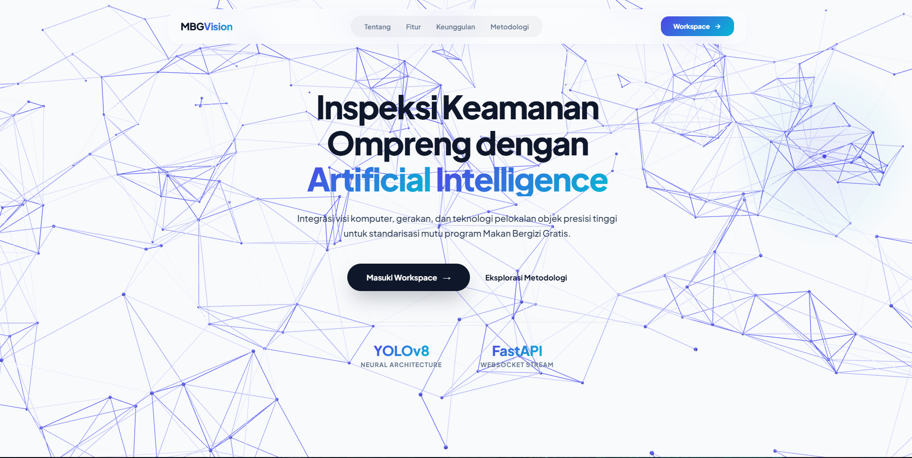

# MBG Vision

Prototipe sistem deteksi benda asing pada makanan menggunakan **YOLOv8**, dikembangkan sebagai proyek tugas akhir untuk mendukung pengawasan kualitas pada program **Makan Bergizi Gratis (MBG)**.

> ⚠️ Proyek ini dibuat untuk keperluan riset dan demonstrasi akademik, bukan produk komersial.

---

## Tentang Proyek

MBG Vision mencoba menjawab tantangan pengawasan kualitas distribusi makanan dengan memanfaatkan model *object detection* untuk mengenali objek anomali (benda asing) pada citra ompreng secara otomatis, baik dari foto yang diunggah maupun dari kamera secara real-time.



## Fitur

- **Upload gambar** — drag & drop atau klik untuk memilih foto ompreng (JPG/PNG/WEBP)
- **Gambar contoh** — coba sistem langsung tanpa perlu siapkan foto sendiri
- **Mode kamera real-time** — streaming deteksi langsung dari webcam via WebSocket
- **Panel transparansi model** — menampilkan status deteksi dan *confidence score* dari hasil inferensi
- **Landing page informatif** — tentang proyek, keunggulan teknis, dan alur metodologi sistem

## Teknologi yang Digunakan

| Bagian       | Teknologi                                  |
|--------------|---------------------------------------------|
| Model AI     | YOLOv8 (object detection)                  |
| Dataset      | TACO (Trash Annotations in Context)        |
| Backend      | FastAPI (REST + WebSocket)                 |
| Frontend     | HTML, CSS, JavaScript (vanilla)            |
| Font         | Plus Jakarta Sans (Google Fonts)           |

## Struktur Proyek

```
.
├── index.html        # Landing page (penjelasan proyek, fitur, metodologi)
├── app.html           # Halaman aplikasi / panel deteksi
├── style.css           # Seluruh styling, animasi, dan desain sistem
├── script.js           # Logika upload, kamera, WebSocket, dan UI interaktif
└── static/
    └── img/
        ├── icon.png
        ├── contoh1.png
        ├── contoh3.png
        └── contoh4.png
```

> Folder `static/img/` berisi favicon dan gambar contoh yang dipakai pada halaman aplikasi. Backend FastAPI (model YOLOv8, endpoint `/detect/` dan `/ws/detect/`) berjalan terpisah dan tidak termasuk dalam berkas frontend ini.

## Cara Menjalankan

### 1. Backend (FastAPI)
Jalankan server backend yang menyediakan endpoint berikut:
- `POST http://localhost:8000/detect/` — deteksi gambar tunggal (menerima `multipart/form-data`, mengembalikan JSON berisi `image_base64`, `detections_count`, dan `confidence`)
- `WS ws://localhost:8000/ws/detect/` — streaming deteksi real-time dari frame kamera

### 2. Frontend
Sajikan file statis (`index.html`, `app.html`, `style.css`, `script.js`, `static/`) melalui server yang sama dengan backend, misalnya dengan me-*mount* folder ini sebagai static files di FastAPI:

```python
from fastapi.staticfiles import StaticFiles

app.mount("/static", StaticFiles(directory="static"), name="static")
```

Lalu akses:
- `http://localhost:8000/` → landing page (`index.html`)
- `http://localhost:8000/static/app.html` → panel deteksi

### 3. Buka di Browser
Buka `http://localhost:8000` lalu klik **"Coba Demo Aplikasi"** untuk masuk ke panel deteksi.

## Alur Kerja Sistem

1. **Input Citra** — pengguna mengunggah foto, memilih gambar contoh, atau mengaktifkan kamera
2. **Inferensi Model** — citra dikirim ke backend FastAPI dan diproses oleh model YOLOv8
3. **Output & Evaluasi** — hasil deteksi (bounding box + confidence score) dikembalikan dan ditampilkan di antarmuka

## 🎓 Informasi Akademik

- **Jenis Proyek:** Tugas Akhir Deep Learning
- **Tahun Akademik:** 2025/2026
